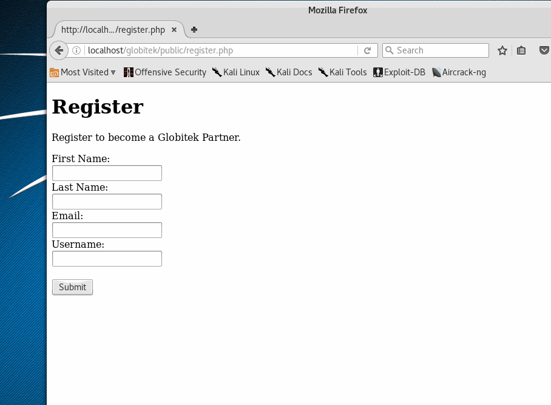

# Project 1 - Globitek CMS

Time spent: **10** hours spent in total

Project By: Luke Thomas

## User Stories

The following **required** functionality is completed:

- [X] Create a Users Table
  - [X] Define a table "users" for columns id, firstname, lastname, email, username, created_at
- [X] Create a Page with an HTML Form
  - [X] with text inputs: first_name, last_name, email, username
  - [X] submits to: itself ("public/register.php")
- [X] Detect when the form is submitted
  - [X] If "/public/register.php" is loaded directly, it should display the form.
  - [X] If the form was submitted, it should retrieve the form data.
- [X] Validate form data
  - [X] Validate the presence of all form values.
  - [X] Validate that no values are longer than 255 characters.
  - [X] Validate that first_name and last_name have at least 2 characters.
  - [X] Validate that username has at least 8 characters.
  - [X] Validate that email contains a "@".
- [X] Display form errors if any validations fail.
  - [X] Do not submit the data to the database.
  - [X] Redisplay the form with the submitted values filled in.
  - [X] Report all errors as a list above the form.
- [X] Submit successfully-validated form values to the database.
  - [X] Write an SQL statement which will insert a new record into the globitek.users table using the submitted form values.
- [X] Redirect the user to a confirmation page.
  - [X] Redirect the user to the new page.
- [ ] Sanitize all dynamic output for HTML.
 

The following advanced user stories are optional:

- [ ] Bonus 1: Validate that form values contain only whitelisted characters.
  - [ ] first_name, last_name: letters, spaces, symbols: - , . '
  - [ ] username: letters, numbers, symbols: _
  - [ ] email: letters, numbers, symbols: _ @ .
  
- [ ] Bonus 2: Validate the uniqueness of the username.

## Video Walkthrough

Here's a walkthrough of implemented user stories:

GIF created with [LiceCap](http://www.cockos.com/licecap/).

## Notes

Describe any challenges encountered while building the app.

First time with sql, took some time to create the database and write the insert statement.

## License

    Copyright [2016] [Luke Thomas]

    Licensed under the Apache License, Version 2.0 (the "License");
    you may not use this file except in compliance with the License.
    You may obtain a copy of the License at

        http://www.apache.org/licenses/LICENSE-2.0

    Unless required by applicable law or agreed to in writing, software
    distributed under the License is distributed on an "AS IS" BASIS,
    WITHOUT WARRANTIES OR CONDITIONS OF ANY KIND, either express or implied.
    See the License for the specific language governing permissions and
    limitations under the License.
